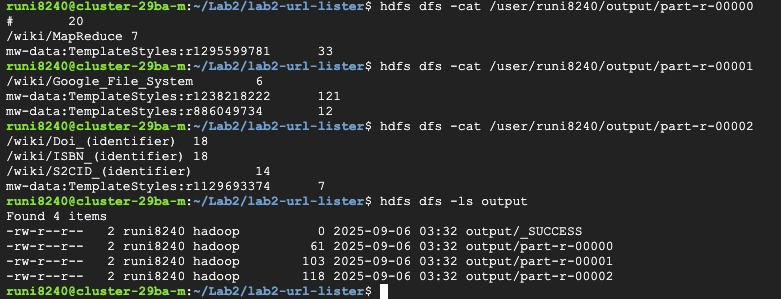
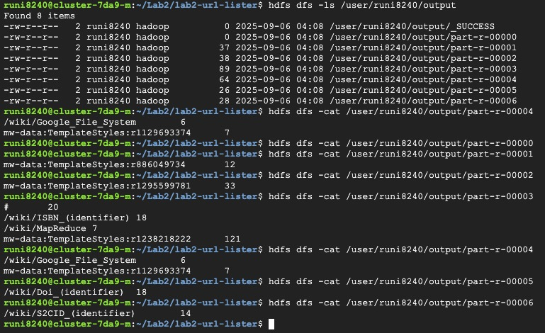

Datacentre Scale Computing LAB Assignment 2 - Convert WordCount to UrlCount

Using the Java Version

- Java File (URLCount.java)
1. I have created a class called URLMapper.
2. The map function reads input line by line and matches with the regex pattern "href=\"[^\"]*" to extract URLs. in the 'href="...' format.
3. To get the output in the desired format, we are removing the first 5 characters from the string. Before the output was 'href="/wiki/ISBN_(identifier)	18' and after removal of first 5 characters it is 'wiki/ISBN_(identifier)	18'

2 - Node Cluster Timing Execution

real    0m43.174s
user    0m10.183s
sys     0m0.533s

4 - Node Cluster Timing Execution

real    0m43.650s
user    0m8.252s
sys     0m0.407s

Observation - 
The execution time for 2-Node  vs 4-Node Clusters is almost similar. There is not a huge difference.

